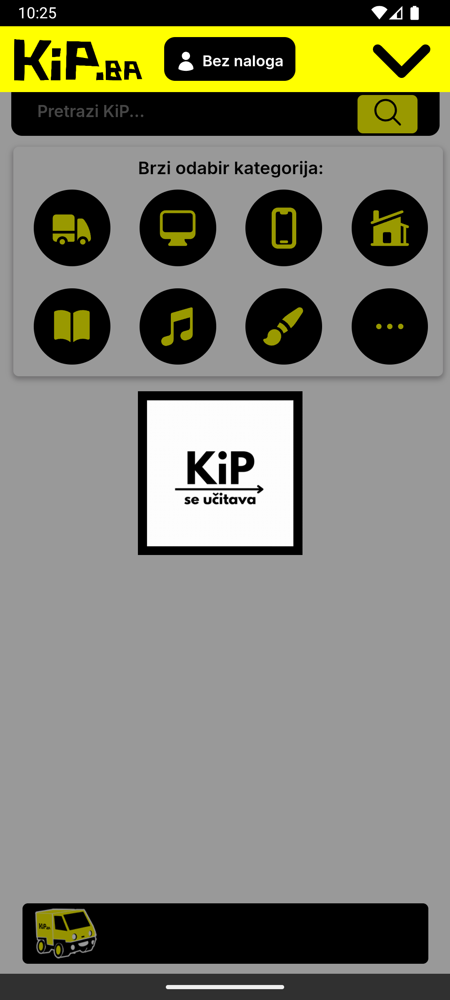
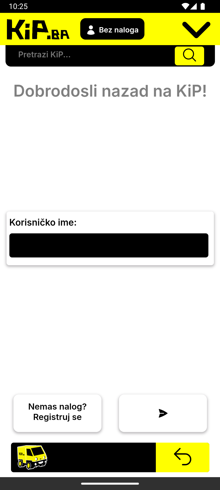
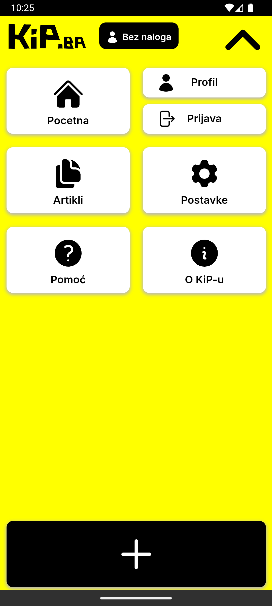

**⚠️ Disclaimer:** This is an **old project** created in 2022. It was developed for learning and experimentation purposes and is no longer actively maintained. The app might not work.

# KiP.ba Mobile


Welcome to **KiP.ba Mobile**, an android marketplace project created in 2022! (say hi to Kippy 👋) This was an experimental project designed to showcase my skills in app development with cordova using PHP, MySQL, HTML, CSS, and JavaScript. The website simulates a platform for users to buy and sell products. 

---

## Features

- **Dynamic Marketplace:** Users can browse, add, and manage product listings.
- **User Accounts:** Basic user authentication and profile management.
- **Database Integration:** All product and user data is stored and managed in an SQL database.
- **Interactive Design:** Utilizes JavaScript for dynamic interactions and enhanced user experience.
- **Responsive Frontend:** Designed with HTML and CSS for a clean and user-friendly interface.

---

## Technologies Used

- **Backend:** PHP (on a seperate server).
- **Database:** MySQL for storing user and product data.
- **Frontend:** HTML, CSS, and JavaScript (all combined into an android app using Cordova).
- **Server Environment:** XAMPP for local development and testing.

---

## Installation and Setup


1. **Install Node.js and Cordova:**

   First, install [Node.js](https://nodejs.org/). Then open a terminal and run:
   ```bash
   npm install -g cordova
   ```

2. **Clone the Repository:**
   ```bash
   git clone https://github.com/harunridjevic/kipmobile
   cd kip.ba
   ```

3. **Install the Android Platform:**
   ```bash
   cordova platform add android
   cordova prepare
   ```

4. **Build and Run on Android:**

   Connect your Android device via USB with USB debugging enabled, then run:
   ```bash
   cordova run android
   ```

   > Make sure you have [Android Studio](https://developer.android.com/studio) and the Android SDK properly set up on your system.


---

## Screenshots

App screens:

  

---

## Additional Notes

While I learned a lot from making a mobile version of the KiP marketplace, I think that the server on which the api.php file was located on stopped working.

---

## Acknowledgements

Thanks to all the resources and tutorials that helped shape this project. KiP.ba mobile reflects my early steps into mobile app development. This project was made by Harun Riđević.

---

## License

This project is licensed under the MIT License. Feel free to use and modify it for your own learning and projects.

